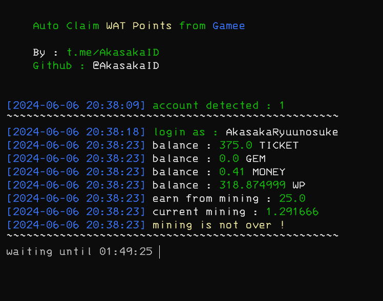

# GameeTod

Auto Claim Wat Point from gamee

<center></center>

# Table of Contents

- [GameeTod](#gameetod)
- [Table of Contents](#table-of-contents)
- [Feature](#feature)
- [Register ?](#register-)
- [How to Use](#how-to-use)
  - [Bot.py Parameter](#botpy-parameter)
  - [Windows](#windows)
  - [Linux](#linux)
  - [Termux](#termux)
- [How to Get Data](#how-to-get-data)
- [Video Guide to Get Data](#video-guide-to-get-data)
- [Javascript Command to Get Telegram Data for Desktop](#javascript-command-to-get-telegram-data-for-desktop)
- [Run for 24/7](#run-for-247)
- [Discussion](#discussion)
- [Support My Work](#support-my-work)
- [Thank you \< 3](#thank-you--3)

<!-- # My Note

```text
Sorry, I can't add the feature to complete the 'race' because my device doesn't support it. 
When I press the play button, it only shows a black blank (like picture number 1), then I asked someone and he replied “maybe your internet is problematic”. Then I waited until this morning and I tried again but still couldn't.
Then I tried to see the console menu and it turned out that there was an error (as shown in picture number 2) that my device did not support playing the game.
So I only updated for mining action, maybe I will update for “racing” action later when I buy rdp (Remote Desktop Protocol / Windows Server) or buy a new device.
That's all, thank you.
```
## Image 1


## Image 2

 -->

# Feature

- [x] Auto Claim
- [x] Auto Daily Spin
- [x] Spin Using Ticket
- [x] Support Multi Account
- [x] Claim Previous Session Mining Rewards

# Register ?

Ask u friend for invitation code !

# How to Use

## Bot.py Parameter

Here are some parameters that can be used in bot.py or the bot's main script

| parameter       | desctiption                                                                         |
| --------------- | ----------------------------------------------------------------------------------- |
| --data          | serves to set custom input data (default: data.txt)                                 |
| --config        | serves to set a custom config file (default: config.json)                           |
| --marinkitagawa | serves to run the bot script without deleting the terminal / console display first. |

## Windows 

1. Make sure you computer was installed python and git.
   
   python site : [https://python.org](https://python.org)
   
   git site : [https://git-scm.com/](https://git-scm.com/)

2. Clone this repository
   ```shell
   git clone https://github.com/akasakaid/gameetod.git
   ```

3. goto gameetod directory
   ```
   cd gameetod
   ```

4. install the require library
   ```
   python -m pip install -r requirements.txt
   ```

5. fill the `data.txt` file with your data, how to get data you can refer to [How to Get Data](#how-to-get-data)
6. execute the main program 
   ```
   python bot.py
   ```

## Linux

1. Make sure you computer was installed python and git.
   
   python
   ```shell
   sudo apt install python3 python3-pip
   ```
   git
   ```shell
   sudo apt install git
   ```

2. Clone this repository
   
   ```shell
   git clone https://github.com/akasakaid/gameetod.git
   ```

3. goto gameetod directory

   ```shell
   cd gameetod
   ```

4. Install the require library
   
   ```
   python3 -m pip install -r requirements.txt
   ```

5. fill the `data.txt` file with your data, how to get data you can refer to [How to Get Data](#how-to-get-data)
6. execute the main program 
   ```
   python bot.py
   ```

## Termux

1. Make sure you termux was installed python and git.
   
   python
   ```
   pkg install python
   ```

   git
   ```
   pkg install git
   ```

2. Clone this repository
   ```shell
   git clone https://github.com/akasakaid/gameetod.git
   ```

3. goto gameetod directory
   ```
   cd gameetod
   ```

4. install the require library
   ```
   python -m pip install -r requirements.txt
   ```

5. fill the `data.txt` file with your data, how to get data you can refer to [How to Get Data](#how-to-get-data)
6. execute the main program 
   ```
   python bot.py
   ```

# How to Get Data
   
   1. Active web inspecting in telegram app, How to activate follow the video [https://youtu.be/NYxHmck_GjE](https://youtu.be/NYxHmck_GjE)
   2. Goto gamee bot and open the apps
   3. Press `F12` on your keyboard to open devtool or right click on app and select `Inspect`
   4. Goto `console` menu and copy [javascript code](#javascript-command-to-get-telegram-data-for-desktop) then paste on `console` menu
   5. If you don't receive error message, it means you successfully copy telegram data then paste on `data.txt` (1 line for 1 telegram data)
   
   Example telegram data

   ```
   query_id=xxxxxxxxxx&user=xxxxxxfirst_namexxxxxlast_namexxxxxxxusernamexxxxxxxlanguage_codexxxxxxxallows_write_to_pmxxxxxxx&auth_date=xxxxxx&hash=xxxxxxxxxxxxxxxxxxxxx
   ```

   6. If you want to add more account. Just paste telegram second account data in line number 2.
   
   Maybe like this sample in below

   ```
   1.query_id=xxxxxxxxxx&user=xxxxxxfirst_namexxxxxlast_namexxxxxxxusernamexxxxxxxlanguage_codexxxxxxxallows_write_to_pmxxxxxxx&auth_date=xxxxxx&hash=xxxxxxxxxxxxxxxxxxxxx
   2.query_id=xxxxxxxxxx&user=xxxxxxfirst_namexxxxxlast_namexxxxxxxusernamexxxxxxxlanguage_codexxxxxxxallows_write_to_pmxxxxxxx&auth_date=xxxxxx&hash=xxxxxxxxxxxxxxxxxxxxx
   ```

# Video Guide to Get Data

The require data is same like [pixelversebot](https://github.com/akasakaid/pixelversebot) so you can watch same tutorial / video guide to get data !

Here : [https://youtu.be/KTZW9A75guI](https://youtu.be/KTZW9A75guI)

# Javascript Command to Get Telegram Data for Desktop

```javascript
copy(Telegram.WebApp.initData)
```

# Run for 24/7 

You can run the script bot for 24/7 using vps / rdp. You can use `screen` application in vps linux to running the script bot in background process

# Discussion

If you have an question or something you can ask in here : [@sdsproject_chat](https://t.me/sdsproject_chat)

# Support My Work

To support me you can buy me a coffee via website in below

- Send IDR directly via QRIS : [https://s.id/nusanqr](https://s.id/nusanqr)
- https://sociabuzz.com/fawwazthoerif/tribe
- USDT (TRC20)
  ```
  TZANkbi8z22cEpkpWfJ1F6H84r9DA19Es1
  ```

# Thank you < 3